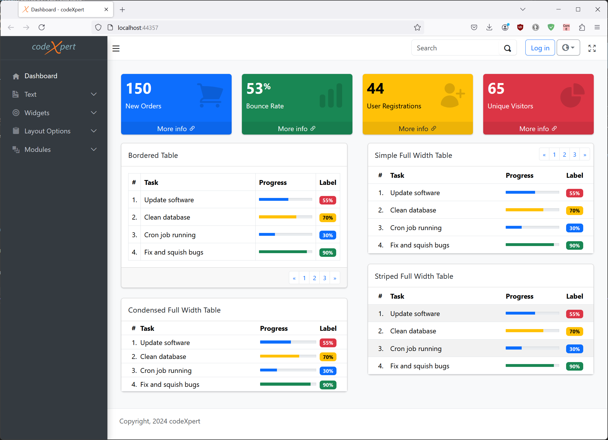

# AdminLTE Template/Theme for Oqtane
This is a theme for [Oqtane](https://www.oqtane.org/). The theme is based on AdminLTE Beta release (https://adminlte.io) and uses Bootstrap 5.3. 

## Features
1. Fits many screen resolutions from small mobile devices to large desktops.
1. Ideal for dashboards
1. Includes new Oqtane Search function. Make sure you use a recent version of Oqtane.
1. Layout options: Default, Fixed, Sidebar Mini
1. Theme settings: Show login, Show register, Theme color (light, dark and custom) and Show breadcrumbs
1. Containers: Default and Card

### Known Issues
1. RTL not working (in development)
1. Based on AdminLTE Beta release
1. Work in progress
